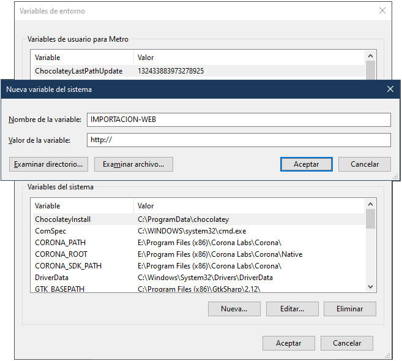

Esta página describe el funcionamiento de la herramienta encargada de migrar los datos hacia el servidor Web que aloja la aplicación para uso exclusivo de clientes.

Permite enviar toda la información en archivos con formato *CSV* de forma programada como manual. Además brinda la posibilidad de enviar archivos comprimidos *Zip* con los ficheros *PDF* de cada uno de los análisis finalizados.

<small>Actualización: **11/11/2020**.</small>

## Instalación y configuración

1. Descargue la última versión mediante el siguiente enlace: [la-migrar-1.0.0.zip](la-migrar-1.0.0.zip)

2. Descomprima el contenido del archivo del punto anterior en la carpeta deseada.

3. Defina la variable de entorno **IMPORTACION-WEB** con el siguiente valor: <http://laboratorioazul.com.ar/clientes/js/cfg_migracion>

    A. Abra el **Panel de control** y diríjase a **Sistema y seguridad** / **Sistema**.

    B.  Clic sobre **Configuración avanzada del sistema** y luego sobre el botón **Variables de entorno**.

    C. En el área definida como *Variables del sistema* haga clic en el botón **Nueva**.

    D. En el cuadro de diálogo *Nueva variable del sistema* ingrese los datos mensionados en el punto 3.

    E. Acepte todos los cambios y reinicie la sesión actual.




## Modo de uso

La herramienta puede utilizarse de dos formas:

```
la-migrar -probar
```
**Permite realizar una prueba de conexión a los servidores Web y FTP.** Debería utilizarse una vez realizada la instalación, y cuando la configuración del equipo o la red cambien.

```
la-migrar <archivos_migrar> [-enc <cantidad | comienzo-línea>] [-aftp <cantidad>] [-rftp <cantidad>]
```

**Comienza el proceso de migración de datos** según los parámetros definidos.

El parámetro **archivos_migrar** es una lista de uno o más archivos a incluir (separados por espacios). Puede indicar el nombre completo de cada uno o incluso utilizar comodines para indicar todos los archivos de una extensión (por ejemplo *.csv).

**-enc** permite indicar la **_cantidad_** de líneas utilizadas como encabezado en los archivos CSV. También puede definirse con un texto (**_comienzo-línea_**) que indique el comienzo de la línea que separa el encabezado del resto del contenido. De esta forma permite incluir archivos con cantidad de líneas de encabezado variables.

**-aftp** permite indicar la **_cantidad_** máxima de archivos a enviar por FTP de forma simultanea. Si se omite el valor predeterminado es de 2 archivos a la vez.

**-rftp** define la **_cantidad_** máxima de reintentos por error en las conexiones FTP. El valor predeterminado es de 2 intentos en caso de fallo.

> Para más información consulte los ejemplos presentados más abajo.


## Funcionamiento

Las extensiones aceptadas son: *.csv*, *.txt* y *.zip*. Cualquier otro tipo de archivo será simplemente ignorado.

El proceso de migración valida y normaliza los archivos *CSV* según los parámetros definidos y los requerimientos definidos en el servidor. Además envía simultaneamente todos los archivos *ZIP* que se especifiquen.

Cada archivo es firmado para impedir cualquier tipo de adulteración durane el proceso.

Una vez finalizado el envío FTP la herramienta finaliza notificando al servidor que la importación debe comenzar.

### Archivos CSV

Los archivos con extensión *.csv* o *.txt* serán procesados como archivos con formato *CSV*. Si alguno de los archivos no supera la validación **todo el proceso será cancelado**. Las líneas "en blanco" en este tipo de archivos serán ignoradas.

Esta herramienta es capaz de identificar el caracter utilizado para separar las columnas. La siguiente tabla muestra los caracteres habilitados para utilizarse como separadores y el orden en que son comprobados:

| Orden | Caracter | Nombre |
|:-----:|:--------:|--------|
|   1   |**```,```**    | coma   |
|   2   |**```;```**    | punto y coma   |
|   3   |**```[tab]```**| tabulador       |
|   4   |**```'```**    | comilla simple       |

### Archivos ZIP

Este tipo de archivos solo será enviado sin ninguna validación adicional. Estos archivos deben contener los ficheros *PDF* con los respectivos análisis finalizados.

Cualquier otro fichero dentro será ignorado por el proceso de importación lanzado una vez se finaliza el envío.


## Ejemplos

```
la-migrar c:\temp\*.csv c:\temp\*.zip
```

> Incluye todos los archivos *.csv* y *.zip* ubicados en la carpeta *c:\temp*.

```
la-migrar c:\temp\*.csv c:\temp\*.zip -enc 2
```

> El mismo ejemplo pero indicando que los archivos CSV cuentan con un encabezado de 2 líneas.

```
la-migrar c:\temp\*.csv c:\temp\*.zip -enc "--"
```

> Una vez más el mismo ejemplo pero esta vez indicando que los archivos CSV tienen varias líneas de encabezado donde la última de este grupo comienza con (al menos) 2 guiones.

```
la-migrar veterinarios.csv *.txt *.zip -rftp 5
```

> Un ejemplo alternativo que muestra cómo indicar varios archivos con nombre único o mediante comodines. En este caso en la carpeta actual donde se encuentre, y reintentando 5 veces en caso de fallos en las conexiones FTP.

---

<small>Desarrollado por **[Pragmática](http://pragmatica.com.ar)**.</small>
